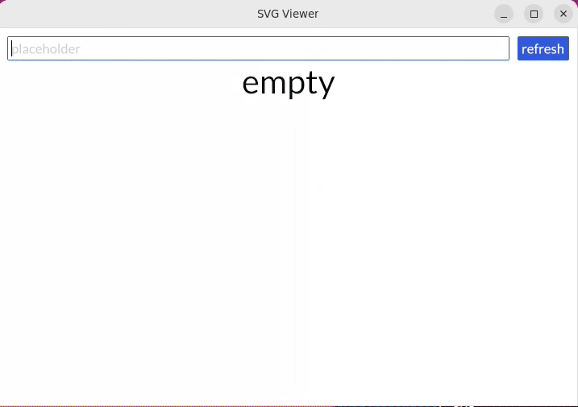

# SVGViewer

an application based on rust-iced. it can show all .svg files in your inputted folder path.



build and run

```
cargo run --release
```


clip source .webm from 13s to 22s
```
ffmpeg -i svgviewer.webm -ss 00:00:13.0 -to 00:00:22.0 clip.webm
```

convert webm to gif

```
ffmpeg -y -i clip.webm -vf palettegen palette.png
ffmpeg -y -i clip.webm -i palette.png -filter_complex paletteuse -r 10 out.gif
```

